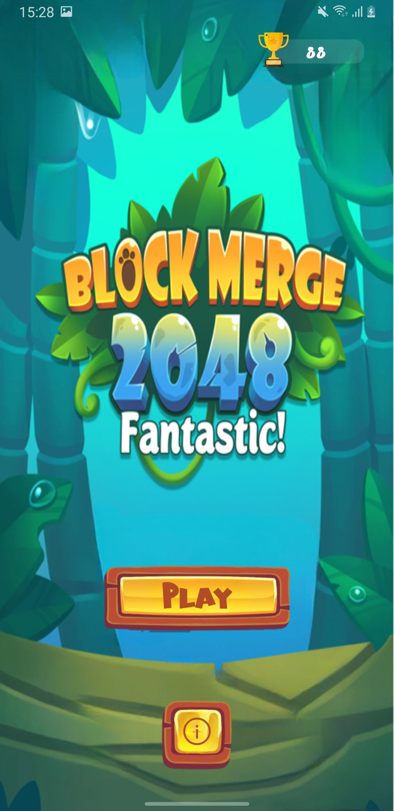
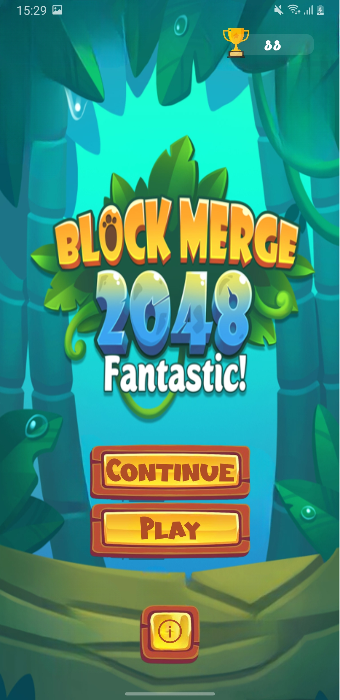
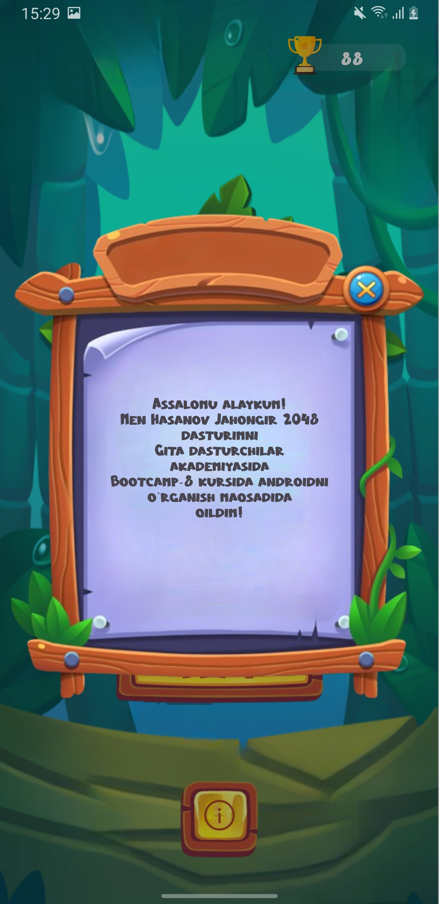
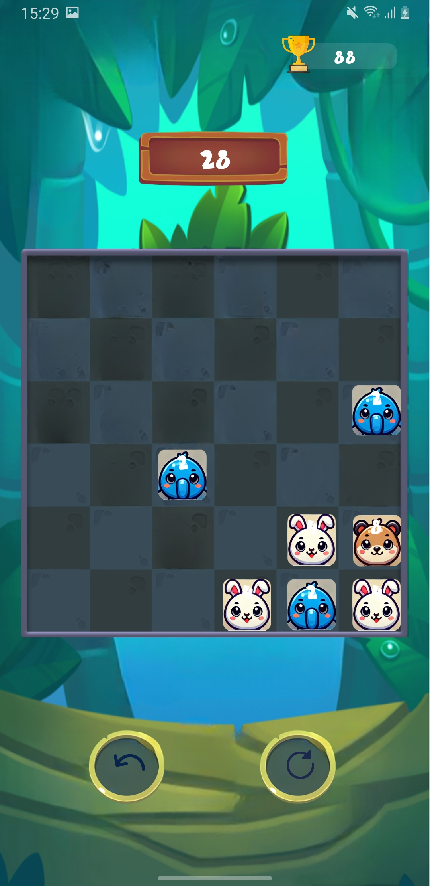

# 🎮 2048 Game
2048 Game is a classic sliding puzzle Android game where players combine matching numbers to reach the 2048 tile. The app provides a smooth and engaging gameplay experience, using Android best practices such as a Single Activity architecture, Fragments, and custom dialogs. User interactions are handled through a custom TouchListener for detecting swipes.

# 📌  Features
🎮 Classic 2048 Gameplay – Slide tiles and merge numbers to reach 2048.

🎯 Touch Controls – Swipe detection using a custom TouchListener.

🧱 Single Activity Architecture – Clean navigation handled with fragments.

🧩 Fragment-Based UI – Dynamic screen rendering with modular fragments.

💾 Score Tracking – Displays current and best score.

# 🛠 Technologies Used:

Technology	Description

Kotlin/Java	Programming language

XML	Layout design

TouchListener	Detect swipe gestures for game interactions

Single Activity	Navigation handled through fragments

Fragments	Game screen and dialog containers

#

  
  
  
  

# 🚀 Running the Project
Download the APK and try it out.

Author: [Hasanov Jahongir]

Contact: [jahonh959@gmail.com]
